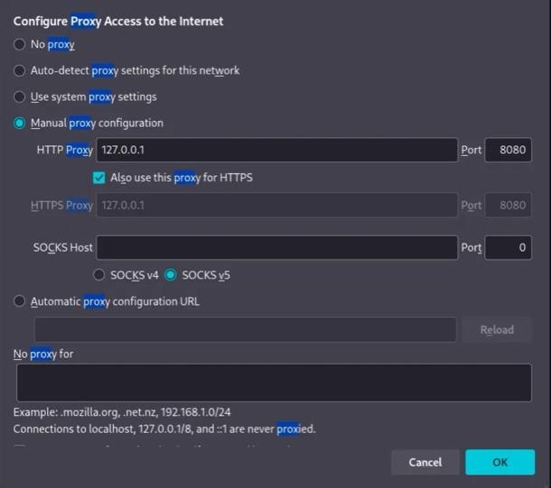
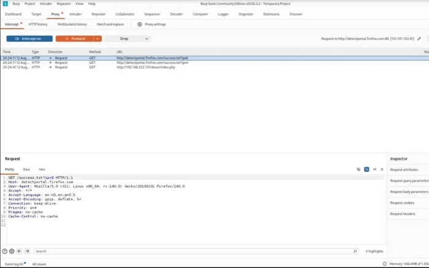
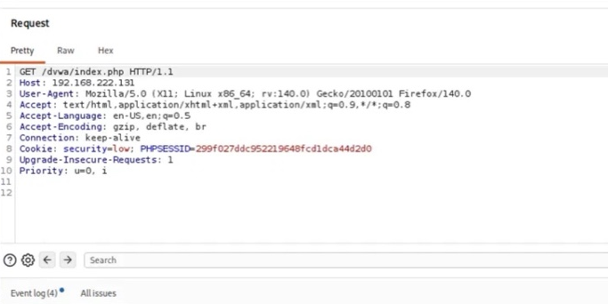
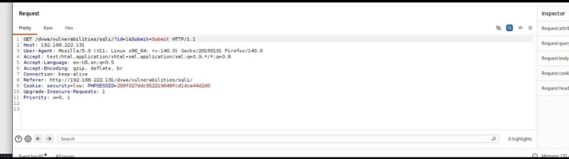
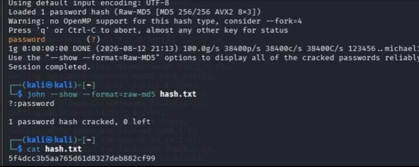

# Web Application Security Lab

## Overview

This home lab documents hands-on web application security testing using **Burp Suite Community Edition** and **DVWA (Damn Vulnerable Web Application)** in an isolated virtual environment.

The goal of the lab was to understand how web applications communicate over HTTP, identify user-controlled input, inspect and manipulate requests, and validate common web application security weaknesses.

## Lab Environment

- Kali Linux
- Burp Suite Community Edition
- DVWA (Damn Vulnerable Web Application)
- Firefox
- Isolated virtual lab network

## Objectives

- Configure Burp Suite as an intercepting proxy
- Capture and inspect HTTP requests
- Understand HTTP headers, cookies, and parameters
- Identify user-controlled application input
- Test application behavior using modified requests
- Practice SQL injection testing
- Understand the security impact of weak password storage

---

## Burp Proxy Configuration

I configured Firefox to route HTTP and HTTPS traffic through Burp Suite using the local proxy listener:

`127.0.0.1:8080`

This allowed Burp Suite to observe and intercept requests between my browser and the intentionally vulnerable web application.

---

## Capturing HTTP Traffic

After configuring the proxy, I verified that requests generated by Firefox were successfully captured inside **Burp Proxy**.

Burp's HTTP History allowed me to review requests generated while interacting with DVWA and identify areas of the application that could be investigated further.

---

## Inspecting a Raw HTTP Request

I examined the raw HTTP request being sent to DVWA.

The request contained information including:

- HTTP request method
- Application path
- Target host
- Browser headers
- Session cookie
- DVWA security setting

Inspecting the raw request helped me understand how application state and user-controlled information are transmitted between the browser and server.

It also demonstrated why security testing should evaluate the actual HTTP request rather than relying only on what is displayed in the browser interface.

---

## SQL Injection Testing

One of the DVWA exercises contained a user-controlled `id` parameter used by the application to retrieve information from its database.

I captured the request in Burp Suite and identified the parameter as a potential injection point.

I then tested how the application handled manipulated input to determine whether the value was safely treated as data or could influence the underlying SQL query.

This exercise demonstrated how insufficient separation between user-controlled input and database queries can result in **SQL injection**.

### Potential Impact

A successful SQL injection vulnerability can potentially allow an attacker to:

- Access information they are not authorized to view
- Enumerate database structure
- Extract sensitive application data
- Obtain stored credential hashes
- Modify or delete information depending on database permissions
- Compromise application confidentiality and integrity

### Recommended Remediation

Applications should use:

- Parameterized queries / prepared statements
- Server-side input validation
- Least-privileged database accounts
- Appropriate error handling
- Secure application development practices

---

## Password Hash Analysis

As part of the intentionally vulnerable application exercise, I also practiced offline password auditing against a recovered password hash.

The exercise demonstrated how weak password choices combined with legacy password hashing can significantly increase the impact of credential exposure.

The password audit successfully recovered a weak password from the lab hash, demonstrating that hashing alone does not provide sufficient protection when weak algorithms and predictable passwords are used.

This reinforced the importance of:

- Modern password hashing algorithms
- Unique salts
- Strong password policies
- Multi-factor authentication
- Protecting credential databases from unauthorized access

---

## Security Concepts Reinforced

### Authentication vs. Authorization

This lab also helped reinforce the distinction between authentication and authorization.

**Authentication** determines who the user is.

**Authorization** determines what that authenticated user is allowed to access or perform.

Both controls must be enforced by the server rather than relying on information controlled by the client.

### Never Trust Client-Side Input

Values sent from the browser can potentially be modified before reaching the application.

Security decisions should therefore not rely solely on client-controlled values such as:

- URL parameters
- Form fields
- Cookies
- Hidden fields
- HTTP headers

The server must independently validate input and enforce security controls.

---

## Key Takeaways

This lab helped reinforce several web application security concepts:

- Burp Suite can provide visibility into communication between a browser and web application.
- HTTP requests can be inspected and modified before reaching the server.
- User-controlled parameters should never automatically be trusted.
- SQL injection can occur when application input is improperly incorporated into database queries.
- Authentication and authorization are separate security controls.
- Weak password storage can significantly increase the impact of a database compromise.
- Manual testing helps demonstrate the real impact of a vulnerability rather than simply identifying its category.
- Understanding normal application behavior makes abnormal or insecure behavior easier to identify.

---

## Tools Used

| Tool | Purpose |
|---|---|
| Burp Suite | HTTP interception and request analysis |
| DVWA | Intentionally vulnerable web application |
| Kali Linux | Security testing environment |
| Firefox | Web application interaction |
| Password auditing tool | Offline analysis of recovered lab hashes |

---

## Disclaimer

All testing documented in this repository was performed against **intentionally vulnerable applications and systems that I controlled inside an isolated home lab** for educational purposes.

No testing was performed against systems without authorization.
